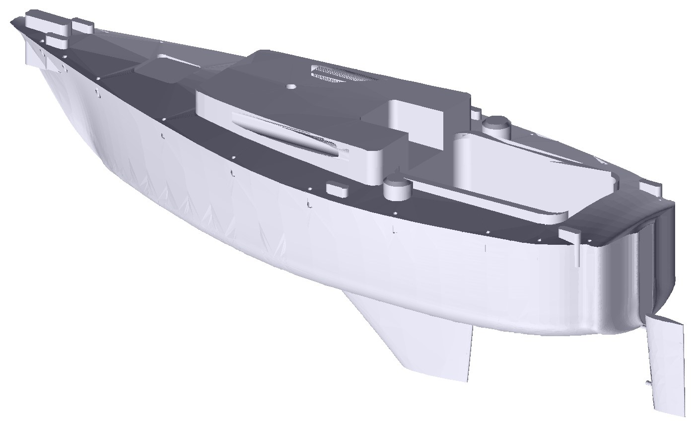
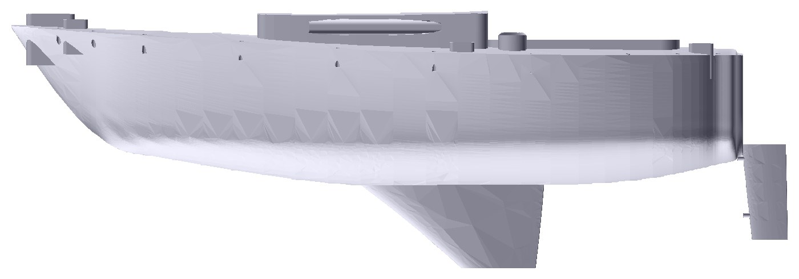
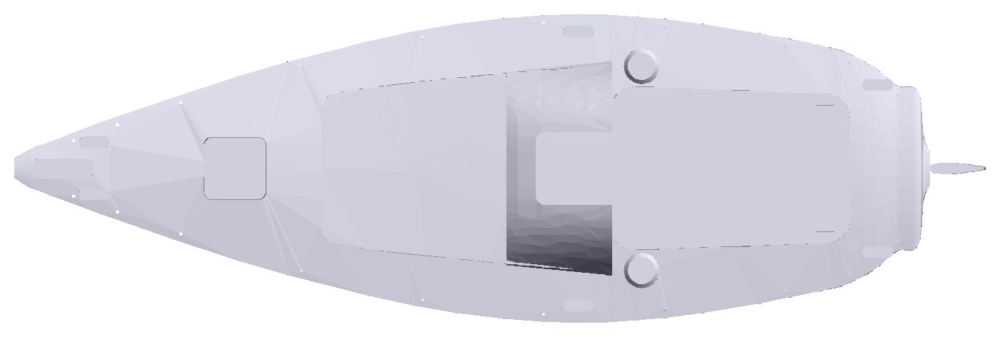

# Hallberg-Rassy 26 — skalamodell i 1:30

Parametrisk 3D-modell av en Hallberg-Rassy 26 (Olle Enderlein, 1978–85),
bygget med [CadQuery](https://cadquery.readthedocs.io/) og lagt til rette for
utskrift på **Bambu Lab A1** (256 × 256 × 256 mm) i PLA.

Skroget printes i **ett stykke**, stående med kjølen ned og dekket opp, plassert
diagonalt på platen. Ror, rigg­beslag og stativ printes som egne deler.



| | |
|---|---|
|  |  |

---

## Hovedmål

Fullskala, fra Hallberg Rassy-katalogen 1981 og HR 26-brosjyren:

| | Fullskala | 1:30 |
|---|---|---|
| Lengde over alt | 7 950 mm | 265,0 mm |
| Vannlinjelengde | 6 700 mm | 223,3 mm |
| Bredde | 2 680 mm | 89,3 mm |
| Dypgang | 1 400 mm | 46,7 mm |
| Deplasement | 2,5 t | – |
| Kjølvekt | 1,1 t | – |
| Seilareal | 32 m² | – |
| Masthøyde over vl | 12 000 mm | 400 mm |

Konstruktør: Olle Enderlein. 7/8-rigg med tilbakesveipte salinger, finnekjøl
støpt i ett med skroget, akterhengt ror, fenderlist rundt hele skroget.

---

## Hvordan skroget er loftet

Det fantes **ikke noe spanteriss** i kildematerialet. Det som fantes var
profiltegning og dekksplan i 1:50, og de er brukt slik:

1. **Dekkslinjen** er sporet ut av dekksplanen, piksel for piksel, og kalibrert
   mot LOA = 7 950 mm. Målt bredde blir da 2 700 mm mot oppgitt 2 680 mm — 0,7 %
   avvik, som sier at tegningen er dimensjonsriktig.
2. **Undervannsprofilen** (kanobunn, kjøl og ror) er sporet ut av profil­tegningen.
   Med vannlinjen lagt der antifoulingen starter blir dypgangen 1 391 mm mot
   oppgitt 1 400 mm — 0,6 % avvik. De to tegningene er altså i samme målestokk,
   og kalibreringen er uavhengig bekreftet.
3. **Springet** er lest av fenderlisten i profiltegningen, som lar seg følge
   sammenhengende fra baug til akter.
4. **Tverrsnittene** er rekonstruert parametrisk: en superellipse mellom kjølen
   og vannlinjebredden under vann, og en jevn utfalling opp til dekkskanten over.
   Fyldigheten varierer langs skroget (`SECTION_FULLNESS` i `hr26/params.py`).

Tverrsnittene er altså en **rekonstruksjon**, ikke en ekte loft fra spanteriss.
Profil, dekkslinje, spring og hovedmål er derimot målt.

De uttrukne kurvene ligger i `data/`:

| Fil | Innhold |
|---|---|
| `hull_stations.csv` | fairet tabell: dekkshalvbredde, spring, kanobunn |
| `deck_halfbreadth.csv` | rå dekkslinje fra dekksplanen |
| `uw_station.csv` | rå undervannsprofil med kjøl og ror |

**Merk om akterspeilet:** i dekksplanen møtes de to sidelinjene i akterspeilets
hjørner, og sporingen tolket det som at skroget smalner av til en spiss.
Halvbredden holdes derfor fast fra `TRANSOM_X` og akterover (`curves.py`), slik
at hekken får den flate akterspeilflaten den skal ha — 1 331 mm bred, altså
50 % av største bredde.

**Merk om deplasementet:** modellen har et beregnet undervannsvolum på ca. 3,9 m³,
mens brosjyren oppgir 2,5 tonn. Avviket kommer av at profiltegningen gir en
forholdsvis dyp og flat kanobunn. For en utstillingsmodell betyr det ingenting —
formen er hentet fra tegningen — men tallet skal ikke brukes til hydrostatikk.

---

## Kjør

```bash
pip install -r requirements.txt
python -m hr26.build                 # alt: skrog, ror, rigg, stativ
python -m hr26.build --hull          # bare skroget (raskt ved utvikling)
python -m hr26.build --no-hollow     # massivt skrog
python -m hr26.build --stations 48   # finere lofting
```

Bygget tar rundt fire minutter. Resultatet havner i `export/stl/`
(print-orienterte STL-er) og `export/step/hr26.step` (hele modellen som STEP).
STEP-fila er på 17 MB og ligger derfor ikke i repoet — den lages av samme
kommando.

Alle mål ligger øverst i `hr26/params.py`. Vil du ha en annen målestokk er det
nok å endre `SCALE` — alt annet følger med, inkludert veggtykkelser og hull­
diametre, som er definert i modell-millimeter og ganget opp.

### Moduler

| Fil | Ansvar |
|---|---|
| `params.py` | alle mål og parametre |
| `curves.py` | fairede skrogkurver, tverrsnitt, deplasement |
| `hull.py` | lofting av skroget, fenderlist |
| `appendages.py` | kjøl og ror med NACA-lignende profil |
| `deckhouse.py` | dekk, ruff, vinduer, cockpit, luker |
| `fittings.py` | utsparinger: mastefot, rekkepåler, pulpit, vinsjer |
| `rig.py` | riggen som byggesett |
| `shell.py` | uthuling med innvendige spant |
| `stand.py` | stativ |
| `plaque.py` | skiltplate |
| `build.py` | setter sammen, orienterer for print, eksporterer |
| `tools/render.py` | kontrollbilder av STL |
| `tools/meshcheck.py` | sjekker at STL-ene er lukkede |

---

## Delene

Fjorten filer i `export/stl/`. Materialtallene er reell geometri ganget med
1,24 g/cm³ — legg til litt for støtte og skjørt.

| # | Fil | Mål (mm) | PLA |
|---|---|---|---|
| 01 | `01_skrog.stl` | 205,1 × 205,1 × 109,4 | 174 cm³ / 216 g |
| 02 | `02_ror.stl` | 34,5 × 3,2 × 18,1 | 1,0 cm³ / 1 g |
| 03 | `03_mast.stl` | 365,5 × 4,0 × 3,0 | 3,4 cm³ / 4 g — **passer ikke på A1** |
| 04 | `04_mastefot.stl` | 9,7 × 8,1 × 4,5 | 0,1 cm³ |
| 05 | `05_masttopp.stl` | 6,7 × 5,5 × 5,5 | 0,1 cm³ |
| 06 | `06_saling.stl` | 56,2 × 14,7 × 3,0 | 0,1 cm³ |
| 07 | `07_bom.stl` | 100,0 × 5,5 × 2,4 | 0,3 cm³ |
| 08 | `08_bom-med-seil.stl` | 100,0 × 10,0 × 8,6 | 3,6 cm³ / 4 g |
| 09 | `09_rekkepaaler.stl` | 24,9 × 54,4 × 1,6 | 0,5 cm³ |
| 10 | `10_boyemal.stl` | 46,0 × 34,0 × 9,0 | 4,8 cm³ / 6 g |
| 11 | `11_stativ-vugge1.stl` | 77,4 × 94,6 × 6,0 | 35,4 cm³ / 44 g |
| 12 | `12_stativ-vugge2.stl` | 74,2 × 106,4 × 6,0 | 36,5 cm³ / 45 g |
| 13 | `13_stativ-bjelke.stl` | 140,7 × 70,0 × 14,0 | 49,9 cm³ / 62 g |
| 14 | `14_skilt.stl` | 104,0 × 46,0 × 3,7 | 14,4 cm³ / 18 g |

**07 og 08 er alternativer** — print den ene. Til sammen blir det rundt
**325 cm³, altså ca. 400 g PLA**: skroget 216 g, stativet 151 g, resten under
35 g. Én rull på 1 kg holder med god margin.

### Slik printes hver del

**01 Skrog** — den store jobben, 12–16 timer.
* Ligger ferdig orientert: kjølen ned, rotert 45°, 205 × 205 mm av platen.
* **Infill 0 %.** Skroget er uthult med 1,5 mm vegg, og innvendige spant hver
  26 mm bærer dekket. Setter du infill blir det bare tyngre og tregere.
* Støtte på, bare under skroget ved baug og hekk. Ingen støtte trengs oppe.
* Lag 0,12–0,16 mm. Ingen brim — kjølen gir god vedheft, og det er plass til
  brim om du vil ha det.
* Vil du ha rødt bunnstoff: fargeskift på **46,7 mm**, som er vannlinjen.

**02 Ror** — printes liggende, 3,2 mm tykt. Støtte av. De to tappene på
forkanten passer i hullene i akterspeilet.

**03 Mast** — 365,5 mm i ett stykke. Se eget avsnitt «Masten» under. Den er
for lang for A1-en, også diagonalt (261 mm mot 256), og må printes på en
printer med minst 366 mm langs én akse eller 262 × 262 mm for diagonal
plassering.

**04–07 Riggbeslag** — små, flate, ligger rett på platen. Ingen støtte.
4 vegger og 25 % infill, ellers blir salingarmene skjøre. Alle har ovalt
4,5 × 3,5 mm hull og kan bare tres på masten én vei.

**08 Bom med seil** — alternativ til 07. Har det surrede storseilet med
kalesje på, slik båten ligger fortøyd.

**09 Rekkepåler** — 16 stk på sprue, ligger flatt. **Ikke roter dem opp.**
Liggende blir øyehullene loddrette og kommer rene ut, og lagene løper langs
pålen, som er den sterke retningen. Bruk brim — delene er små og lette.

**10 Bøyemal** — hjelpeverktøy, ikke en del av modellen. Til å bøye pulpit og
pushpit av 1,0 mm messingtråd rundt.

**11–13 Stativ** — vuggene liggende, 6 mm tykke, ingen støtte. Bjelken har
lettelseshull. 15 % infill holder. Tre vuggene ned på tappene.

**14 Skilt** — flatt, ingen støtte. Teksten står 0,7 mm opphøyd. Legg inn
**fargeskift på 3,0 mm**, så kommer HUGO og resten ut i egen farge.

### Deler du må skaffe selv

* **Masten printes** (del 03), men trenger en større printer enn A1 — se
  «Masten». Vil du heller lage den av et ovalt 4,0 × 3,0 mm emne på 366 mm,
  passer det i de samme hullene.
* **Pulpit og pushpit:** **1,0 mm messingtråd**, bøyd rundt tappene på bøyemalen.
* **Livliner:** tynt tauverk eller tråd, opptil 0,4 mm. Tres gjennom øynene på
  rekkepålene — se under.

Rekkepålene printes (del 08) og trenger ikke messingtråd.

---

## Masten

Del 03 er masten i ett stykke: **365,5 mm** lang, rett oval profil
**4,0 × 3,0 mm** hele veien, faset i begge ender. De nederste 11 mm står nede i
det ovale hullet i ruffen; 355 mm er synlig. Salingen og masttoppen tres på
ovenfra før masten settes i ruffen, bommen til slutt.

Profilen er jevntykk med vilje. En 26-fots cruiser fra rundt 1980 har en rett
alu-profil uten avsmalning, og en eventuell avsmalning i toppen ville uansett
vært under en halv millimeter i 1:30.

### Den passer ikke på A1-en

Liggende trenger den 366 mm. Diagonalt på en 256 × 256 mm plate blir det
261 mm — 5 mm for mye. Den må printes på en printer med **minst 366 mm langs
én akse, eller 262 × 262 mm** for diagonal plassering. En Bambu X1 eller P1 har
samme plate som A1 og går heller ikke; en 300 × 300 mm plate gjør det.

### Slik printes den

Det er en 366 mm lang strek på 4 × 3 mm. Alt handler om å holde den rett.

* **Liggende med den brede siden ned** — STL-en ligger allerede slik. Da er den
  bare 3 mm høy, og lagene løper langs masten, som er den sterke retningen.
  Ingen støtte trengs; ingenting henger i lufta.
* **Brim, 6–8 mm.** Fotavtrykket er bare 15 cm², og uten brim løsner enden
  halvveis ut i printen.
* **Bare vegger, ingen infill.** Sett veggantallet til 6, så fylles hele
  tverrsnittet av sammenhengende perimetre. Det gir maksimal stivhet.
* **Sakte og kaldt.** Ytre vegg 40–50 mm/s, vifte 100 %. PLA, ikke PETG eller
  ASA: PLA er stivest og krymper minst, og det er nettopp stivhet og rettlinjethet
  som betyr noe her. ASA krøller seg opp fra platen på en åpen printer.
* **Print to eller tre samtidig** og bruk den retteste. Det koster 4 gram.
* **La platen bli helt kald** før du tar den løs. Trekker du i en varm, tynn del
  bøyer du den.
* Legg den ferdige masten på et flatt bord og se etter bue. En svak bue rettes
  ved å holde den i 60 °C vann i et halvt minutt og legge den under en bok
  til den er kald.

Stående i ruffen bærer masten seg selv med god margin: den veier 4 gram, og
knekklasten for en 366 mm PLA-stav med dette tverrsnittet er rundt 60 gram.
Det som kan knekke den, er å miste den på gulvet før den er limt.

## Om mastprofilen

En alu-mastprofil er ikke rund. Den er tydelig dypere for-akter enn på tvers,
med likespor i bakkant. Anslått for en HR 26 blir det i størrelsesorden
120 × 90 mm i virkeligheten, altså **4,0 × 3,0 mm** i 1:30.

Det er **én mast**, men fem separate deler sitter på den, hver med sitt eget
hull — som fem perler på samme snor:

| Høyde over ruffen | Del | Hullets rolle |
|---|---|---|
| −11 mm | hullet i ruffen | masten stikker ned i dekket |
| 0 mm | mastefot | beslaget limes rundt masten |
| ca. 220 mm | saling | tres på og skyves opp |
| ca. 355 mm | masttopp | hetten helt øverst |
| ca. 50 mm | bom | ringen i enden går rundt masten |

Alle fem er derfor ovale, **4,5 × 3,5 mm**. Var bare hullet i ruffen ovalt,
ville masten sitte riktig nede ved dekket, men slingre i de fire beslagene
lenger oppe.

Klaringen på 0,25 mm per side er rikelig: hull i PLA kommer typisk ut 0,1–0,2 mm
trangere enn nominelt, og det er lettere å fylle med lim enn å file ut et for
trangt hull i en ferdig printet del.

Den ovale formen låser samtidig masten mot å vri seg. Salingarmene kan altså
ikke snurre rundt og peke feil vei, slik de ville gjort med et rundt hull.

Målene er et **anslag**. Har du skyvelær på den virkelige masten, eller et
nærbilde av masten ved foten med noe av kjent størrelse inntil, sett de målte
tallene inn i `MAST_SECTION_X` og `MAST_SECTION_Y` i `hr26/params.py` og bygg
på nytt — alle fem hullene følger med. Mastens *lengde* trenger du ikke måle;
katalogens 12 m over vannlinjen er verftets eget tall.

Mastefoten er beholdt selv om hullet i ruffen kunne tatt masten alene: HR 26 har
dekksmontert mast, og fotbeslaget er godt synlig på ruffen. Den er gjort lav og
platelignende slik originalen er, i stedet for en høy hylse.

---

## Rekkverket

Rekkepålene printes med **ekte øyer**: hver påle har to gjennomgående hull på
0,5 mm, i 10 og 20 mm høyde, som livlinene tres gjennom. Arket har 16 påler —
12 til båten og 4 i reserve — på en sprue under tappene, så øynene står fritt
og pålene kan klippes av uten å korte inn tappen.

Pålene er 1,1 mm tykke, som svarer til 33 mm i virkeligheten. En ekte rekkepåle
er ca. 25 mm, så de er fortsatt litt grove, men de er nå tynne nok til å lese
riktig — og tykke nok til å tåle å bli håndtert.

De printes **liggende**. Det gir to fordeler: øyehullene står loddrett og
kommer rene ut av printeren, og lagene løper langs pålen, som er den sterke
retningen i bøyning. Står de derimot oppreist, knekker de ved første berøring.

Et 0,5 mm hull kommer typisk ut 0,35–0,40 mm med en 0,4 mm dyse. Det holder til
tråd opp til ca. 0,3 mm. Vil du ha tykkere tauverk, kjør et 0,5 mm bor gjennom
for hånd, eller øk `LIFELINE_EYE_D` i `params.py` og bygg på nytt.

Hullene i dekket er 1,1 mm. Vil du heller bruke messingtråd til pålene, passer
1,0 mm rett i.

---

## Print

**Skroget**

* Orientering: stående, kjølen ned — STL-en ligger allerede riktig.
* Plassering: rotert 45°, opptar 203 × 203 mm av platen.
* Støtte: **bare under skroget**. I Bambu Studio: støttetype «tre (auto)»,
  «kun på plate» avslått er ikke nødvendig — kjølen står på platen, og det
  eneste som trenger støtte er den lille undersiden ved hekk og baug.
* Skroget er allerede uthult med 1,5 mm vegg og innvendige spant hver 26 mm.
  **Sett infill til 0 %** — spantene bærer dekket.
* Lag: 0,12–0,16 mm. Fin dyse (0,2 mm) gir tydeligere fenderlist og vinduer.
* Ingen brim nødvendig; kjølen gir god vedheft. Vil du ha brim, er det plass.

**De små delene**

Ligger flatt og trenger verken støtte eller brim. Salingen og bommen er tynne —
print dem med 4 vegger og 25 % infill.

**Stativet**

Vuggene printes liggende (6 mm tykke). Bjelken har lettelseshull. Tre vuggene
ned på tappene; ingen lim nødvendig om passformen blir stram.

---

## Skiltet

Del 13 er en liten plate med opphøyd tekst, ment å stå foran eller ved siden
av stativet:

```
                     HUGO
              Hallberg-Rassy 26
  Konstruktør Olle Enderlein · bygget 1978–1985
 Lengde 7,95 m · Bredde 2,68 m · Dypgang 1,40 m
       Deplasement 2,5 t · Seilareal 32 m²
                 Skala 1:30
```

Teksten står 0,7 mm over platen, altså rundt seks lag med 0,12 mm laghøyde.
Legger du inn et **fargeskift på 3,0 mm** i Bambu Studio, kommer teksten ut i
en annen farge enn platen — svart tekst på hvit plate ser bra ut, og på A1
er det bare å bytte rull manuelt når printeren stopper.

Båtens navn står også **i relieff på akterspeilet**, 0,35 mm opphøyd, slik
en Hallberg-Rassy bærer navnet sitt. Akterspeilet er en loddrett flate, så
bokstavene printes uten utheng.

Navnet ligger i `BOAT_NAME` i `hr26/params.py` og brukes begge steder. Sett
det til `""` for å droppe det. Resten av skiltteksten ligger i
`hr26/plaque.py` som `TYPE_LINE`, `LINES` og `SCALE_LINE`.

---

## Montering

1. Rens hullene i dekket med et 1,6 mm bor for hånd.
2. Klipp rekkepålene av sprua (del 08), puss tappen flat, og lim dem i hullene.
   Sørg for at øynene peker for-akter, ellers går ikke livlinene gjennom.
3. Bøy pulpit og pushpit av 1,0 mm messingtråd rundt tappene på bøyemalen
   (del 09) og lim dem i.
4. Lim mastefoten i utsparingen i ruffen.
5. Tre salingen på masten til ca. 213 mm over foten, og masttoppen i enden.
   Alle beslagene er ovale og kan bare tres på én vei — lang akse for-akter.
6. Sett masten i foten. Stag og vant: tynn tråd fra masttoppen til
   rekkepåle­festene.
7. Roret: tappene passer i de to hullene i akterspeilet.
8. Tre livlinene gjennom øynene, stram lett, og lim endene i pulpit og pushpit.

---

## Videre arbeid

* Cockpiten er forenklet — ingen brodekk, benker eller luker.
* Sprayhooden er massiv. En ekte kalesje er åpen bakover, men i 1:30 ville
  veggene blitt under en halv millimeter. Frontvinduet er utelatt av samme
  grunn — skjæres det dypt nok til å synes, blir det en tunnel tvers gjennom.
  Males heller inn.
* Ruffens forkant er noe kantet mot originalen.
* Ingen innredning. Skroget er uthult, så den kan legges til senere.
* Skroget har 11 ikke-manifolde kanter av 169 000 — rester etter boolske
  operasjoner rundt utsparingene. Bambu Studio reparerer dette automatisk ved
  import. Alle øvrige deler er helt lukkede. Kjør
  `python tools/meshcheck.py export/stl/*.stl` for å se status.

### Plass til større målestokk

Skroget opptar 203 × 203 mm diagonalt. Platen er 256 × 256 mm. Fordi baugen er
spiss blir det roterte fotavtrykket mindre enn et rektangel ville tilsi, og det
er derfor rom for opptil omtrent **1:24** (LOA 331 mm, fotavtrykk ~254 mm).
Endre `SCALE` i `hr26/params.py` og bygg på nytt.

---

## Kilder

* Hallberg Rassy: *Katalog 1981* — hovedmål, masthøyde, motor
* Hallberg Rassy: *HR 26*-brosjyre — profil 1:50, dekksplan 1:50, sailplan 1:100
* Fotogrammetri-scan av en HR 26 — brukt som referanse for dekkslayout,
  ruff og cockpit. Scannet er ikke dimensjonsriktig (ca. 20 % for langt i
  forhold til bredden) og er derfor ikke brukt som geometri.
* Fotografier av båten på land og fortøyd — kjølprofil, spring, akterspeil
